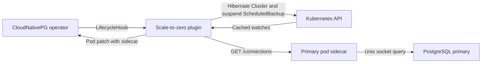

<div align="center">
  
</div>

# CNPG-I Scale-to-Zero Plugin

A [CNPG-I](https://github.com/cloudnative-pg/cnpg-i) plugin that automatically hibernates inactive [CloudNativePG](https://github.com/cloudnative-pg/cloudnative-pg/) clusters to optimize resource usage and reduce costs.

## Overview

This plugin monitors PostgreSQL database activity and automatically hibernates
clusters after a configurable inactivity period. It injects a passive HTTP
probe into every PostgreSQL pod. A central scraper in the plugin deployment
watches CloudNativePG resources, probes the current primary, and performs all
Kubernetes updates.

### How It Works

1. **Sidecar Injection**: The lifecycle hook adds a passive connections probe
   to every PostgreSQL pod.
2. **Cached Discovery**: The central scraper watches `Cluster`, `Pod`, and
   `ScheduledBackup` objects and selects `status.currentPrimary`.
3. **Activity Scraping**: The scraper requests `GET /connections` from the
   current primary sidecar. The sidecar queries PostgreSQL through the shared
   Unix socket and returns the open connection count.
4. **Safe Inactivity Tracking**: Only consecutive successful zero-connection
   scrapes count toward inactivity. Missing pods, unhealthy clusters, timeouts,
   and probe errors reset the inactivity window.
5. **Central Hibernation**: After the inactivity threshold, the plugin sets
   `cnpg.io/hibernation=on` and suspends the same-name `ScheduledBackup`.

### Architecture



The sidecar has no Kubernetes client and receives no sidecar-specific RBAC.
Kubernetes reads and writes are owned by the central plugin service account.

## Installation

For detailed installation instructions, see [INSTALL.md](INSTALL.md).

Quick start:

```bash
kubectl apply -f manifest.yaml
```

## Container Images

The plugin consists of two container images:

- **Plugin**: `ghcr.io/xataio/cnpg-i-scale-to-zero`
- **Sidecar**: `ghcr.io/xataio/cnpg-i-scale-to-zero-sidecar`

### Image Tags

We publish different image tags for different use cases:

#### Local Docker library

- `dev`: local docker images built using `make docker-build-dev`

#### GHCR

##### Development Tags

- `main`: Latest development build from the main branch
- `main-<sha>`: Specific commit builds from main branch

##### Release Tags

- `latest`: Latest stable release
- `v1.0.0`, `v1.1.0`, etc.: Specific version releases

## Usage

Enable scale-to-zero for a PostgreSQL cluster by adding the plugin and configuration annotations:

```yaml
apiVersion: postgresql.cnpg.io/v1
kind: Cluster
metadata:
  name: my-cluster
  annotations:
    xata.io/scale-to-zero-enabled: "true"
    xata.io/scale-to-zero-inactivity-minutes: "10"
spec:
  instances: 3
  enableSuperuserAccess: true
  plugins:
    - name: cnpg-i-scale-to-zero.xata.io
  storage:
    size: 1Gi
```

### Configuration

The plugin behavior is configured through cluster annotations:

- `xata.io/scale-to-zero-enabled`: Set to `"true"` to enable scale-to-zero functionality
- `xata.io/scale-to-zero-inactivity-minutes`: Sets the inactivity threshold in minutes before hibernation (default: 30 minutes)

The plugin automatically manages the `cnpg.io/hibernation` annotation to trigger cluster hibernation and pauses any associated scheduled backups to prevent backup failures on hibernated clusters.

See the [cluster example](doc/examples/cluster-example.yaml) for a complete configuration.

#### RBAC

The installation manifest grants the central plugin service account permission
to watch pods and CloudNativePG resources and to update clusters and scheduled
backups. No per-cluster sidecar RBAC is required.

#### Resource Configuration

The plugin allows you to configure resource requests and limits for the injected sidecar containers through environment variables in the plugin deployment. This enables you to tune resource allocation based on your cluster requirements.

**Default Sidecar Resources:**

- CPU Request: `50m` (0.05 cores)
- CPU Limit: `200m` (0.2 cores)
- Memory Request: `64Mi`
- Memory Limit: `64Mi`

**Override via Environment Variables:**

You can override these defaults by modifying the plugin deployment manifest before applying it:

```yaml
# In manifest.yaml, find the deployment and modify the env section:
env:
  - name: LOG_LEVEL
    value: info
  - name: SIDECAR_CPU_REQUEST
    value: "100m"
  - name: SIDECAR_CPU_LIMIT
    value: "500m"
  - name: SIDECAR_MEMORY_REQUEST
    value: "128Mi"
  - name: SIDECAR_MEMORY_LIMIT
    value: "128Mi"
```

**Override at Runtime:**

You can also update resource configuration after deployment using kubectl:

```bash
# Update sidecar resource configuration
kubectl set env deployment/scale-to-zero -n cnpg-system \
  SIDECAR_CPU_REQUEST=100m \
  SIDECAR_CPU_LIMIT=500m \
  SIDECAR_MEMORY_REQUEST=128Mi \
  SIDECAR_MEMORY_LIMIT=128Mi

# Restart the plugin to apply changes
kubectl rollout restart deployment/scale-to-zero -n cnpg-system
```

**ConfigMap Override:**

For environment-specific configurations, you can create a ConfigMap:

```yaml
apiVersion: v1
kind: ConfigMap
metadata:
  name: scale-to-zero-resource-overrides
  namespace: cnpg-system
data:
  SIDECAR_CPU_REQUEST: "200m"
  SIDECAR_MEMORY_LIMIT: "512Mi"
---
# Then reference it in the deployment by adding to envFrom:
envFrom:
  - configMapRef:
      name: scale-to-zero-resource-overrides
      optional: true
```

These resource configurations apply to all sidecar containers injected by the plugin across all clusters.

## Monitoring and Observability

The central plugin logs scrape eligibility, probe errors, and hibernation
errors. Sidecar logs cover probe startup and PostgreSQL query errors.

You can view the plugin logs using:

```shell
kubectl logs -n cnpg-system deployment/scale-to-zero
```

View a pod's passive probe logs with:

```shell
kubectl logs <postgres-pod-name> -c scale-to-zero
```

Prometheus metrics are exposed by the plugin on the service port named
`metrics`.

## Development

For local development and building from source:

```bash
# Build binaries
make build

# Build Docker images
make docker-build-dev

# Run tests and linting
make test
make lint

# Local Kubernetes development
tilt up
```

This plugin uses the [pluginhelper](https://github.com/cloudnative-pg/cnpg-i-machinery/tree/main/pkg/pluginhelper) from [`cnpg-i-machinery`](https://github.com/cloudnative-pg/cnpg-i-machinery) to simplify the plugin's implementation.

For additional details on the plugin implementation, refer to the [development documentation](doc/development.md).

## Limitations

### Primary-Only Activity Tracking

Currently, the plugin only monitors database activity on the **primary instance**. This means:

- **Read-only workloads on replicas are not tracked** - If your application connects directly to replica instances for read queries, this activity will not prevent hibernation
- **Replica-only traffic** - Clusters with active read traffic exclusively on replicas may be hibernated despite being in use
- **Connection pooling to replicas** - Applications using connection poolers that direct read traffic to replicas will not be detected as active

**Workaround**: Ensure critical read workloads also maintain at least one connection to the primary instance, or configure longer inactivity periods to account for replica-only usage patterns.

**Future Enhancement**: Replica activity monitoring may be added in future versions to provide more comprehensive activity detection across the entire cluster.
