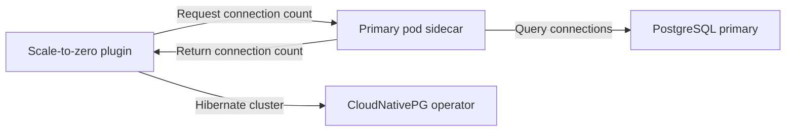

  

# CNPG-I Scale-to-Zero Plugin

A [CNPG-I](https://github.com/cloudnative-pg/cnpg-i) plugin that automatically hibernates inactive [CloudNativePG](https://github.com/cloudnative-pg/cloudnative-pg/) clusters to optimize resource usage and reduce costs.

## Overview

This plugin monitors PostgreSQL database activity and automatically hibernates
clusters after a configurable inactivity period.

### How It Works

1. The plugin injects a sidecar HTTP server into each PostgreSQL pod. The
   server returns the number of open connections.
2. The central plugin periodically requests the connection count from the
   primary pod.
3. Successful responses with open connections reset the inactivity period.
   Errors or unavailable data do not count as inactivity.
4. After consecutive zero-connection responses for the configured period, the
   plugin hibernates the cluster and suspends its scheduled backup.

### Architecture

## Installation

See the [installation guide](INSTALL.md) for prerequisites, deployment,
configuration, verification, and troubleshooting.

## Container Images

The plugin consists of two container images:

- **Plugin**: `ghcr.io/xataio/cnpg-i-scale-to-zero`
- **Sidecar**: `ghcr.io/xataio/cnpg-i-scale-to-zero-sidecar`

### Image Tags

We publish different image tags for different use cases:

#### Local Docker library

- `dev`: local docker images built using `make docker-build-dev`

#### GHCR

##### Development Tags

- `main`: Latest development build from the main branch
- `main-<sha>`: Specific commit builds from main branch

##### Release Tags

- `latest`: Latest stable release
- `v1.0.0`, `v1.1.0`, etc.: Specific version releases

## Usage

Enable the plugin and scale-to-zero annotations on a CloudNativePG `Cluster`.
See the [installation guide](INSTALL.md#enable-a-cluster) or the complete
[cluster example](doc/examples/cluster-example.yaml).

## Monitoring and Observability

Prometheus metrics are exposed by the plugin on the service port named
`metrics`. See the [troubleshooting guide](INSTALL.md#troubleshooting) for log
and health checks.

## Development

This plugin uses the [pluginhelper](https://github.com/cloudnative-pg/cnpg-i-machinery/tree/main/pkg/pluginhelper) from [`cnpg-i-machinery`](https://github.com/cloudnative-pg/cnpg-i-machinery) to simplify the plugin's implementation.

See the [development documentation](doc/development.md) for implementation
details, build commands, and local testing with Tilt.

## Limitations

### Primary-Only Activity Tracking

Currently, the plugin only monitors database activity on the **primary instance**. This means:

- **Read-only workloads on replicas are not tracked** - If your application connects directly to replica instances for read queries, this activity will not prevent hibernation
- **Replica-only traffic** - Clusters with active read traffic exclusively on replicas may be hibernated despite being in use
- **Connection pooling to replicas** - Applications using connection poolers that direct read traffic to replicas will not be detected as active

**Workaround**: Ensure critical read workloads also maintain at least one connection to the primary instance, or configure longer inactivity periods to account for replica-only usage patterns.

**Future Enhancement**: Replica activity monitoring may be added in future versions to provide more comprehensive activity detection across the entire cluster.
